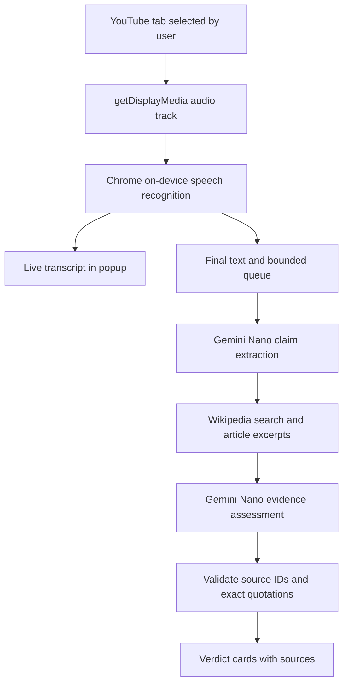

# Proofline Local

A black-and-white Chrome extension that opens a companion popup beside YouTube. It transcribes shared tab audio on your device and checks selected factual claims against Wikipedia excerpts. **No API key, account, backend server, Node.js installation, or paid API is required to use it.**

This is an early source-assisted fact-checking prototype. Its verdict concerns a statement and the retrieved evidence; it does not determine whether a speaker intended to lie.

## Install and start

1. Clone this repository or extract its downloaded ZIP, and keep the resulting folder on your computer.
2. In Google Chrome, paste `chrome://extensions` into the address bar.
3. Turn on **Developer mode**, click **Load unpacked**, and select this package's **extension** subfolder. Select the folder containing `manifest.json`, not the outer package folder.
4. Open a YouTube video or livestream. Pin **Proofline Local** from Chrome's Extensions menu, then click its icon.
5. In the companion window, click **Set up local AI**. Click **Download speech model**, wait for it to finish, then click **Download local AI**. The two separate clicks preserve the browser gestures required for model preparation.
6. When both models are ready, click **Done**, then **Start listening**. In Chrome's sharing picker, choose the **YouTube browser tab**, enable **Share tab audio**, and click **Share**. Keep the video playing.
7. Open **Transcript** to watch provisional words update. **Fact-checks** shows completed checks with explanations and sources. Click **Stop listening** to end capture and let pending checks finish; close the popup to end the session entirely.

The popup is a normal, movable extension window. It stays open when you return to YouTube; it is not an always-on-top operating-system window. Re-clicking the extension icon on the same YouTube tab focuses the existing popup.

To update this unpacked version, replace its files, click **Reload** on its `chrome://extensions` card, refresh YouTube, and reopen Proofline.

## Requirements and setup

Use **Google Chrome 139 or newer on a supported macOS, Windows, or Linux desktop**. This release accepts English audio (`en-US`). It checks the browser's actual speech and language-model availability before enabling listening. ChromeOS, mobile Chrome, and other browsers are outside this release's supported path.

Both model downloads are managed by Chrome and need internet access initially. Their download size, readiness, and hardware requirements depend on Chrome and its model version. An 8 GB machine is not automatically supported or unsupported: the setup panel's capability checks determine whether this browser can prepare the requested models. Consult [Chrome's current hardware requirements](https://developer.chrome.com/docs/ai/get-started#hardware), which include operating-system, storage, GPU/CPU, and network conditions.

After preparation, transcription and language-model inference run locally. **Wikipedia searches still need internet access.** Chrome can remove downloaded models when storage becomes constrained, so setup may be needed again. The extension never silently switches to cloud transcription or microphone capture. See [Chrome's on-device speech support](https://developer.chrome.com/blog/new-in-chrome-139) and [Prompt API documentation](https://developer.chrome.com/docs/ai/prompt-api).

If setup is unavailable, the **Explore a sample session** button still demonstrates the interface. Its three NASA examples, transcripts, verdicts, and timing are prewritten. The sample does not listen, run AI, or demonstrate live verification accuracy.

## Product flow and architecture

The user starts an explicit tab-sharing session. The captured audio track feeds Chrome's on-device speech engine directly; there is no recorded-audio upload or server transcription hop. Provisional text appears immediately when recognition events arrive. Only final text enters the claim-checking queue.

Gemini Nano extracts a completed factual claim and a short topic query. The extension searches English Wikipedia, retrieves article introduction excerpts, and asks the local model to assess that claim using only those excerpts. Extracted wording must match a contiguous span of the transcript; the model cannot silently correct a speaker’s assertion. Before displaying an evidence-backed verdict, code validates source IDs and checks that each returned quotation appears exactly in a fetched excerpt. An exact quotation confirms traceability; it does not prove that the model interpreted it correctly.



| Layer | Technology | Role |
| --- | --- | --- |
| Extension | Chrome Manifest V3 and service worker | Opens and coordinates the persistent companion window |
| Interface | HTML, CSS, native JavaScript modules | Monochrome popup, transcript, claim cards, setup |
| Capture | `navigator.mediaDevices.getDisplayMedia()` | User-selected YouTube tab audio |
| Transcription | Web Speech API with `processLocally = true` | Chrome's local speech engine (SODA), interim and final results |
| Claim analysis | Chrome Prompt API, Gemini Nano | Claim extraction and evidence assessment on the device |
| Evidence | English Wikipedia public API | Topic search, introduction excerpts, source revisions |
| Validation | Local JavaScript | Structured response checks, source and quotation validation |
| Storage and backend | Session memory only; no backend | Keeps the current view without an application database |
| Development checks | Node.js built-in test runner | Mocked API, state, and lifecycle tests |

The recognizer runs in the top-level extension window because Chrome restricts local speech model setup inside cross-origin iframes. It always calls `recognition.start(capturedAudioTrack)`, with local processing required. Recognition may reconnect a bounded number of times after unexpected endings while the shared track remains live.

## What the verdicts mean

| Verdict | Meaning in this prototype |
| --- | --- |
| Supported | The model judges that the retrieved excerpts support the whole claim |
| Contradicted | The model judges that the retrieved excerpts directly contradict the claim |
| Missing context | A qualification in the evidence materially changes the statement's meaning |
| Insufficient evidence | The evidence, transcription, scope, or model output is inadequate for a verdict |

Opinions, preferences, predictions, jokes, questions, and unfinished statements are intended to be skipped. Missing evidence never means a claim is false. Review the linked sources before relying on a result.

## Current limits

- **Wikipedia only.** This version does not search the whole web, independently corroborate multiple publishers, or prioritize official documents. Introductory excerpts can omit decisive details, and recent events may be missing or outdated.
- **Model errors remain possible.** Speech recognition can mishear names, numbers, negation, accents, or overlapping speakers. Claim extraction and verdict reasoning can also be wrong, including when a quotation is authentic.
- **No latency guarantee.** Response speed depends on hardware, model readiness, speech complexity, and Wikipedia's response time. The direct audio-track path reduces avoidable processing steps; it has not been established as the fastest method across devices.
- **Not every statement is checked.** The queue combines nearby final fragments, selects at most one claim per batch, and can discard an older queued batch when overloaded. The popup reports skipped work. Sessions end after 30 minutes, and claim checking has a per-session limit.
- **Approximate timing.** Displayed times are relative to when listening began, not the YouTube video's original timestamps. They are approximate recognition times, not word-level audio alignment.
- **Explicit capture every session.** You must choose the YouTube tab and share its audio. The extension cannot silently select the source or start capture. Navigating away from the source video or closing its tab ends the active session.
- **No saved session history.** The extension keeps the current transcript and cards in memory. Starting a new session clears previous results; closing the popup loses them. It does not save full recordings or transcripts to disk.

## Privacy and permissions

Audio, transcripts, claim extraction, and language-model inference stay on the device. The extension sends selected factual topic search queries to **English Wikipedia** and retrieves article excerpts. Those requests expose the query and normal connection metadata to Wikipedia. They do not upload the full transcript or audio. Clicking a source opens that website normally.

Chrome manages model downloads and local model storage. Cancelling setup stops this extension's preparation flow; Chrome may finish a speech-model download in the background. This extension does not store its own recordings, transcripts, API credentials, or session database.

The extension requests `activeTab` and `scripting` to associate the popup with the YouTube tab and detect navigation. Its only persistent website permission is `https://en.wikipedia.org/*` for evidence requests. Audio access comes from Chrome's explicit screen-sharing picker.

## Troubleshooting

| Problem | What to try |
| --- | --- |
| Nothing opens, or the icon shows “YT” | Open a YouTube video in the active tab, refresh it, and click Proofline again |
| Setup says “Unavailable” | Update Google Chrome, check free disk space and Chrome's hardware requirements, and use the top-level Proofline popup; do not assume a model can run because the browser version is new |
| A download is pending | Keep Chrome and the popup open on an unmetered internet connection; let one model finish before preparing the other |
| Speech preparation fails | Reopen setup and retry its download button; Chrome's English local speech component must be available before listening can start |
| The picker opens but listening fails | Choose a browser tab, select YouTube, and enable **Share tab audio**; window or whole-screen selections are rejected |
| No words appear | Check that the selected tab is playing speech and sharing audio; stop and select the correct tab again |
| Transcript appears but checks are uncertain | Wikipedia may lack a useful introduction excerpt; also check your network connection and the transcript's accuracy |
| A check takes a long time or a segment is skipped | Local inference may be saturated; let pending work finish, close other demanding applications, or start a shorter session |
| Listening stops after navigation | Open the new YouTube video and start a new sharing session |
| Results disappear after closing | Sessions are intentionally in memory only; there is no saved history in this version |

For browser model diagnostics, paste `chrome://on-device-internals` into Chrome's address bar. Setup availability and actual model preparation are more meaningful than a successful feature-name check alone.

## Developer verification

End users do not need Node.js. Developers can run the automated suite with Node.js 22 or newer from this package directory:

```sh
npm test
```

The automated tests use mock browser APIs and streams. They check capture constraints, local-only recognition, transcript updates, lifecycle behavior, source validation, and evidence handling. They do not download models or prove live transcription latency, model accuracy, or end-to-end performance on a real YouTube stream.

Verification on September 9, 2026: all **46 automated tests pass**. The unpacked extension was loaded, enabled, pinned, and opened from a real YouTube tab in Chrome 152. Both local model downloads completed. The on-disk package is now version **0.2.1**; reload its card in `chrome://extensions` and reopen Proofline to pick up the fixes made during testing.

A separate browser test using the shipped speech module and the public `whisper.cpp` JFK audio sample produced its first interim result in **1,241 ms**, its first final segment in **3,008 ms**, and a final segment during graceful stop. An interim misrecognition corrected itself in the final text. This single sample is not a latency or accuracy guarantee.

Real model tests exposed limitations that mocked tests cannot establish:

- “The Earth orbits the Sun” received Supported with a Wikipedia revision link, about 24 seconds after model initialization.
- An initial false-statement test was incorrectly rewritten during extraction. Version 0.2.1 now requests verbatim assertions and rejects changed wording before evidence lookup; the real retest preserved the original statement.
- The Sun/planet false-statement test still received Insufficient evidence. The evidence-assessment prompt was clarified, but this does not establish reliable fact-check accuracy.
- A later false statement about Jupiter reached the 45-second extraction deadline and produced no verdict. Startup time also varied substantially.
- “Jupiter is beautiful” was not filtered out as an opinion; its evidence assessment timed out and the card became Insufficient evidence. Opinion filtering is therefore not yet reliable.

**Local AI verification is still experimental and was not reliable enough in these tests to present this prototype as a finished fact-checking product.** Installed-extension audio capture and end-to-end live YouTube verification remain pending: browser security blocks automated access to the installed extension’s internal page, so its capture session must be started through the user interface by the user. The independent component test uses ordinary localhost pages; the shipped extension contains no preview shim or test audio.
